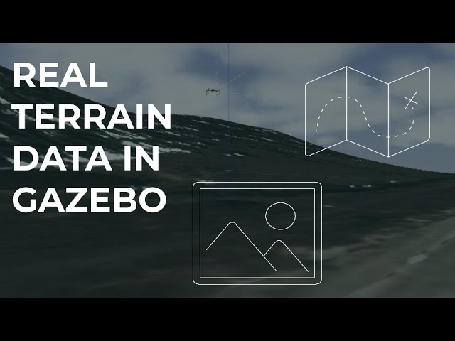
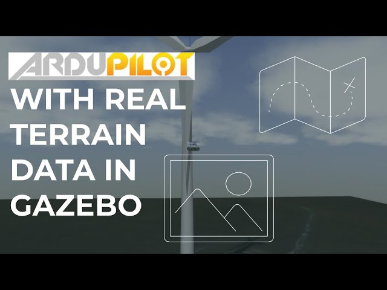

# Gazebo Terrain World Modeling 

WORK IN PROGRESS

## Generate Terrain Model

[](https://youtu.be/mj_IFuDVt3w)

## Accurate Terrain in Gazebo With Ardupilot 

[](https://youtu.be/acsc1I_BKOM)

## Create World Model of a Real World Location

In addition to generating a textured terrain model from intelligentquads.com, you can make your world look more professional and Life like by adding a blue sky with clouds. Adding the gazebo sun model will also help with lighting. Below is a world template that is helpful for creating professional worlds 

```
<?xml version="1.0" ?>
<sdf version="1.5">
  <world name="default">
    <scene>
      <sky>
        <clouds>
          <speed>12</speed>
        </clouds>
      </sky>
      <ambient>0.4 0.4 0.4 1</ambient>
      <background>0.25 0.25 0.25 1</background>
    </scene>
   
    <!-- A global light source -->
    <include>
      <uri>model://sun</uri>
    </include>
   
    <model name="map">
        <include>
        <pose>0 0 0 0 0 -0.57</pose>  
        <uri>model://terrain_map_model</uri>
        </include>
    </model>

    <model name="iris">
      <include>
        <uri>model://drone_with_camera</uri>
      </include>
      <!-- use script to place location -->
      <pose> 60 0 1.25 0 0 -3.1</pose>
    </model>

    <!-- other models ... -->
	</world>
</sdf>
```


