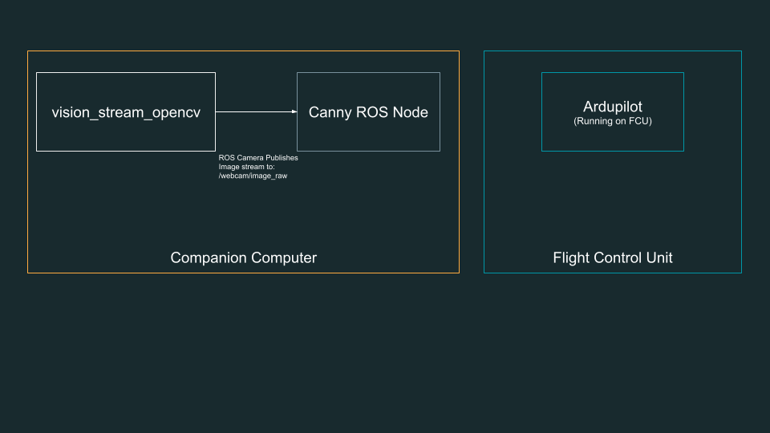
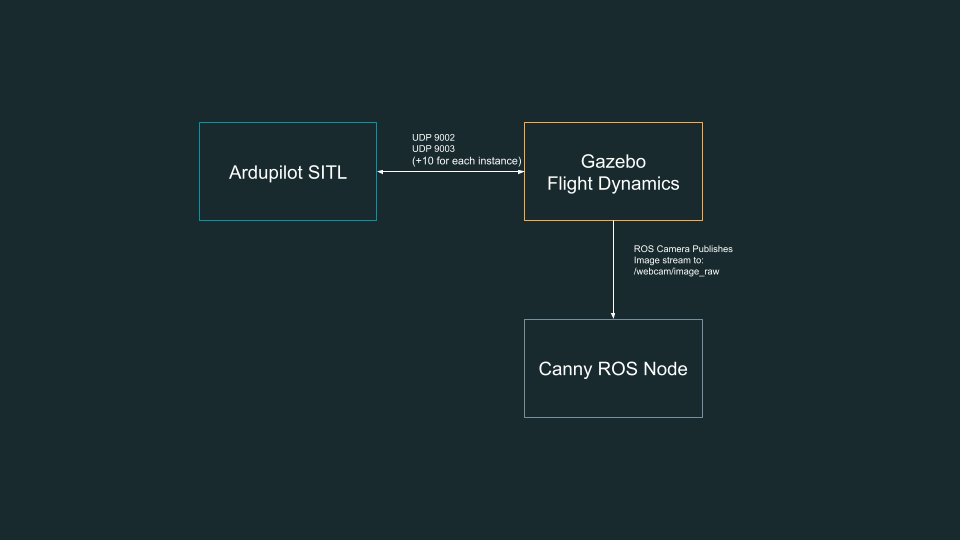

# Introduction to OpenCV for Drone Applications

This tutorial assumes you have installed the ardupilot-sitl with the ardupilot gazebo plugin. This tutorial will teach you how to create a simple computer vision algorithm to be run on a ROS image stream.

This tutorial is based on the cv_bride tutorial http://wiki.ros.org/cv_bridge/Tutorials/UsingCvBridgeToConvertBetweenROSImagesAndOpenCVImages

## Concept of Operation 

It is important to hav an understanding of how this might be used on a real drone and the differences that exist between our real aircraft and the simulation environment. 

Real Aircraft:


On a real ardupilot drone, vision processing is often done on a companion computer. This allows the Flight Control Unit (FCU) to be dedicated to controlling the aircraft while less flight critical tasks are off-loaded to a secondary computer, usually more optimized for high level autonomy tasks.  

Simulated Aircraft:

In our simulated environment we will be using the gazebo ros camera plugin which will publish an image stream of what our simulated camera is seeing. On a real drone we might use the [video_stream_opencv](http://wiki.ros.org/video_stream_opencv) package to create the video stream from a real camera. In the simulated environment we will be skipping this step and having gazebo do this job for us. 
## Pre-Req

Clone the iq_vision ros package
```
git clone https://github.com/Intelligent-Quads/iq_vision.git
```

## Setup 

create the file `canny_edge.cpp` in `iq_vision/src`

Add the following line to the end of the `CMakeLists.txt`
```
add_executable(canny_edge src/canny_edge.cpp)
target_link_libraries(canny_edge ${catkin_LIBRARIES} ${OpenCV_INCLUDE_DIRS})
```

## Setup our ROS node 

the following code contains the includes the needed ros libraries as well as the opencv libraries we will need for the tutorial.

```
#include <ros/ros.h>
#include <image_transport/image_transport.h>
#include <cv_bridge/cv_bridge.h>
#include <sensor_msgs/image_encodings.h>
#ifdef ROS_NOETIC
#include <opencv4/opencv2/imgproc/imgproc.hpp>
#include <opencv4/opencv2/highgui/highgui.hpp>
#else 
#include <opencv2/imgproc/imgproc.hpp>
#include <opencv2/highgui/highgui.hpp>
#endif
// Add vision object here

int main(int argc, char** argv)
{
  ros::init(argc, argv, "image_converter");
  ros::spin();
  return 0;
}
```


## Creating an Object to do Vision Processing 

```
class ImageConverter
{
  ros::NodeHandle nh_;
  image_transport::ImageTransport it_;
  image_transport::Subscriber image_sub_;
  image_transport::Publisher image_pub_;

public:
  ImageConverter()
    : it_(nh_)
  {
    // Subscrive to input video feed and publish output video feed
    image_sub_ = it_.subscribe("/webcam/image_raw", 1,
      &ImageConverter::imageCb, this);
    image_pub_ = it_.advertise("/image_converter/output_video", 1);

    cv::namedWindow("source");
    cv::namedWindow("canny");
  }

  ~ImageConverter()
  {
    cv::destroyWindow("source");
    cv::destroyWindow("canny");
  }

  void imageCb(const sensor_msgs::ImageConstPtr& msg)
  {
    cv_bridge::CvImagePtr cv_ptr;
    try
    {
      cv_ptr = cv_bridge::toCvCopy(msg, sensor_msgs::image_encodings::BGR8);
    }
    catch (cv_bridge::Exception& e)
    {
      ROS_ERROR("cv_bridge exception: %s", e.what());
      return;
    }

    // Run Canny edge detector on image
    cv::Mat src = cv_ptr->image;
    cv::Mat dst;
    cv::Canny( src, dst, 0, 0, 3 );

    // Update GUI Window
    cv::imshow("source", src);
    cv::imshow("canny", dst);
    cv::waitKey(3);

    sensor_msgs::ImagePtr msg_out = cv_bridge::CvImage(std_msgs::Header(), "mono8", dst).toImageMsg();
    // Output modified video stream
    image_pub_.publish(msg_out);
  }
};

```

The above code shows how to subscribe to a ros image stream and run an opencv image processing algorithm on the images. The method `imageCb` will be called when receiving a new image in the image stream `/webcam/image_raw`

