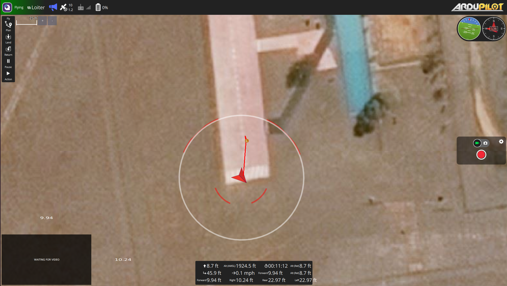
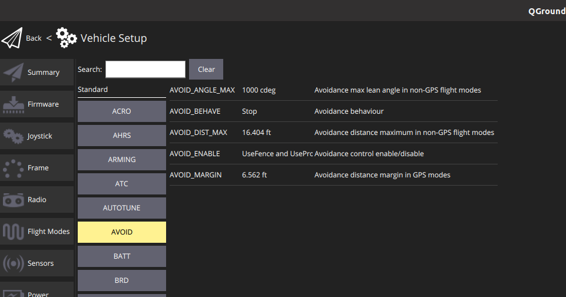
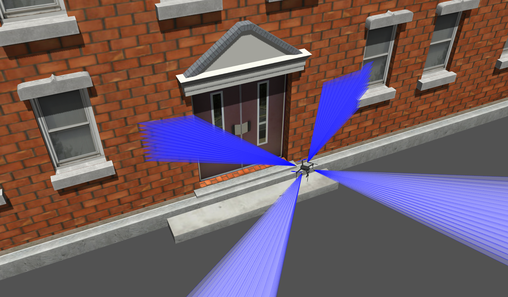
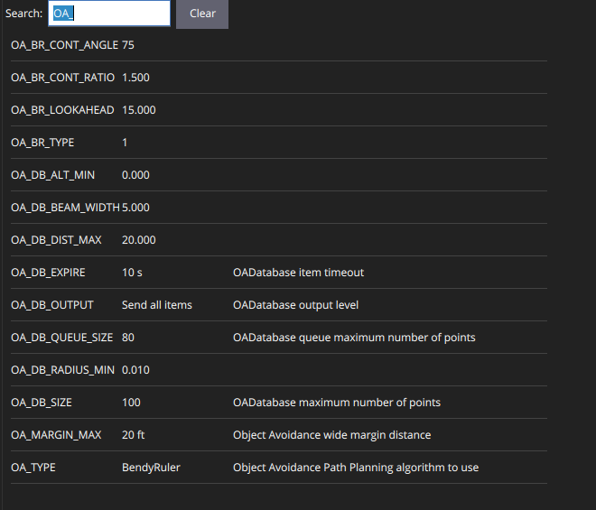
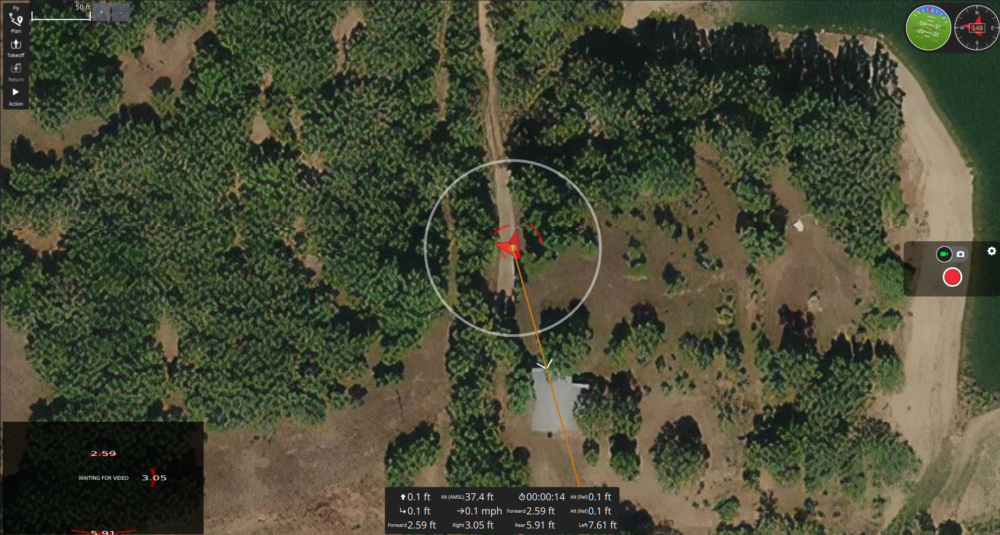
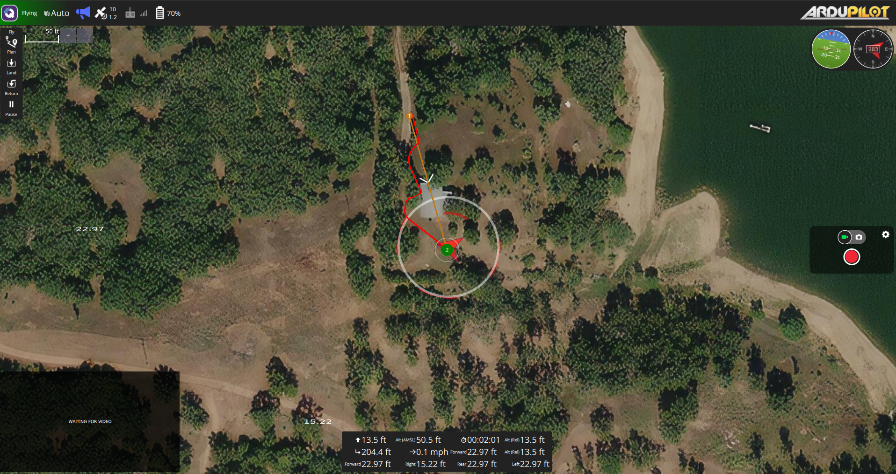

# Ardupilot Proximity Sensing

Ardupilot now comes with obstacle avoidance features for both manual and automated flight modes. This tutorial shows how these features work and what they are capable of. The next tutorial will go into the theory of how the sensors and software work as well as how to simulate the sensors in gazebo. 



## Launching the Pre-Made Simulation

This Tutorial assumes you have install and updated to the iq_sim as well as are running arupilot `Copter-4.1` or higher. 

### Updating Ardupilot 

```
cd ~/ardupilot 
git fetch
git checkout Copter-4.1
git pull
git submodule update --init --recursive
```
make sure dependencies are up to date. run
```
Tools/environment_install/install-prereqs-ubuntu.sh -y
```

clean your build environment 
```
cd ~/ardupilot 
./waf clean
```

In new versions of ardupilot, the sitl assumes you are running from a folder that is unique. This is because, the sitl now stores params and log in file in the directory from which you run the sitl. below is an example of how i now run my sitl.
```
mkdir ~/drone1
cd ~/drone1
sim_vehicle.py -v ArduCopter -f gazebo-iris --console
```

### IQ Range Finder Plugin

The iq range finder plugin is a slight variation on the gazebo ros range finder plugin. My range finder plugin is essentially the same, except that when the there is no object in the sensor's field of view the plugin publishes nan instead of the value of the range_max. Providing rnage_max when there are no detection was problematic because ardupilot's comparison is inclusive of the sensor range max.  To install my plugin run the following.

```
cd ~/catkin_ws/src
git clone https://github.com/Intelligent-Quads/gazebo_ros_pkgs.git
```
build your catkin workspace
```
catkin build
```

### Update IQ Sim

```
cd ~/catkin_ws/src/iq_sim
git pull
```


### Run Sim 

First Terminal 
```
roslaunch iq_sim lake_travis.launch 
```

Second Terminal 
```
cd ~/catkin_ws/src/iq_sim/scripts/drone_travis
./drone1.sh
```

Third Terminal
```
roslaunch iq_sim apm.launch 
``` 

## Obstacle Avoidance in Manual Mode 

The next tutorial will show how to configure the sensors and simulation. This tutorial will show how to configure the avoidance modes. Below are the list avoidance parameters: 




The parameter I will focus on is `AVIOD_BEHAVE`. The `AVIOD_BEHAVE` param controls the behavior of the avoidance in  non-auto flight modes. The options for this param are "slide" and "stop".

From ardupilot wiki sliding does the following: 

"In LOITER, either stopping in front of the object or a “sliding” algorithm is used to avoid it. “Sliding” involves slowing and slightly yawing as the vehicle approaches the object. For example, if Copter approaches a fence line at an angle, it will “slide along” the fence as the operator pushes the Copter toward the fence. Head-on approaches would stop, even if the pilot continues to “pushes” it forward."

**Note:** for a drone with 4 range sensors as shown below the drone will be unable to slide since a forward detection will not be able to tell which side of the "beam" the object is.




## Obstacle Avoidance in Auto Flight Modes

Ardupilot now has a couple avoidance algorithms available to in Ardupilot's auto modes now. 



The OA_Type allows you to select an avoidance algorithm you would like to use in automated flight. For this tutorial we will focus on the "bendy ruler" algorithm. 


The Next Parameter that is important to consider when using Ardupilot's built in obstacle avoidance algorithms is the `WPNAV_SPEED` parameter. This Parameter controls the max speed the drone can fly at. If you avoidance sensor has a shorter range it is important to limit the speed your drone can fly at since the shorter the range a drone can perceive the obstacle the less time it has to react. For this tutorial I will be setting the `WPNAV_SPEED` Parameter to 300 (300 cm/s).


## Warning

While making this tutorial I noticed that the current avoidance algorithm has what I would consider undesired behavior. If the aircraft takesoff from a location that has obstacles within the `AVOID_MARGIN`,  then the aircraft will immediately take avoidance measures during takeoff. this can be specially problematic if you have sonar sensors that get returns from the ground prior to takeoff. Below is a picture that shows the situation I commonly experience in simulation.



## Demo 

I will demonstrate this capability in Loiter, Auto and Guided Flight modes. 




---
#### References 

- https://ardupilot.org/copter/docs/common-object-avoidance-landing-page.html
- https://ardupilot.org/copter/docs/common-simple-object-avoidance.html
- https://ardupilot.org/copter/docs/common-oa-bendyruler.html