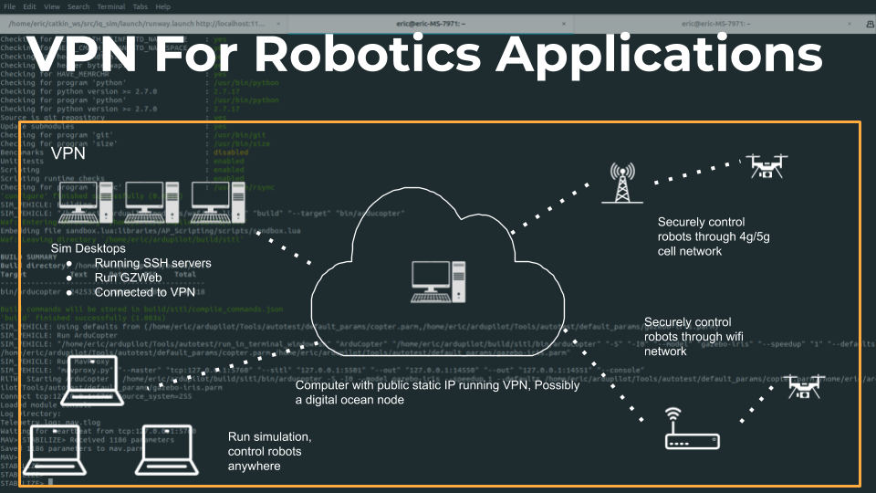
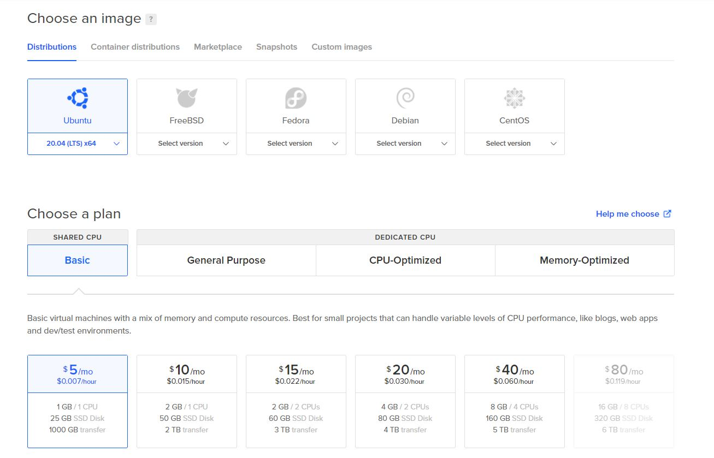
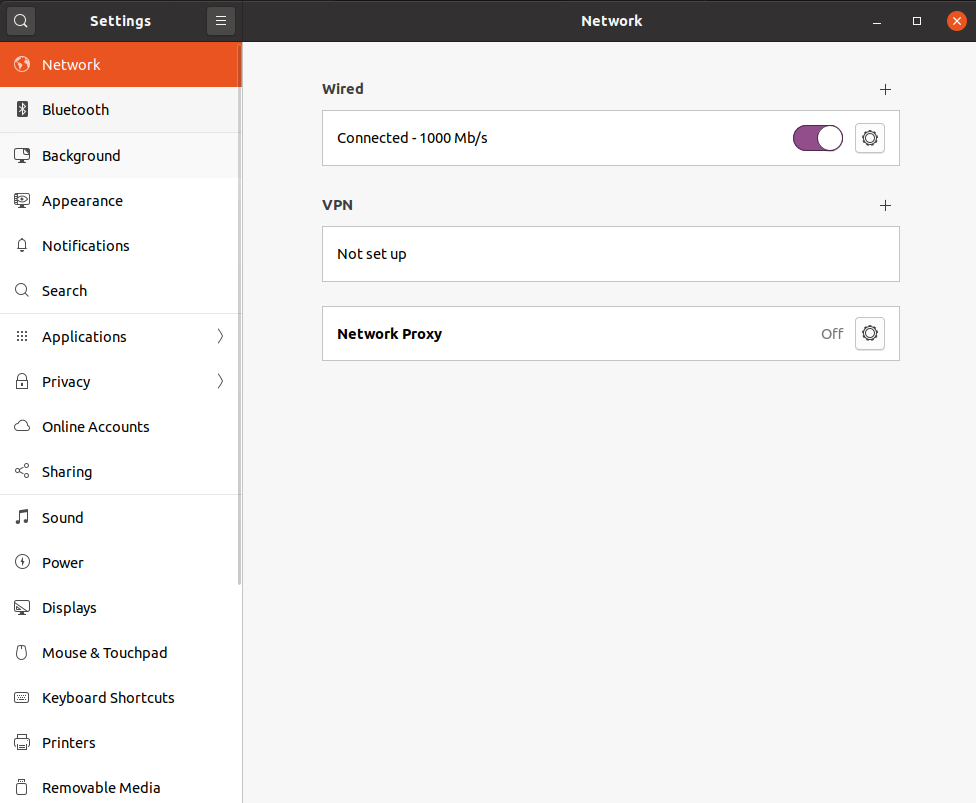
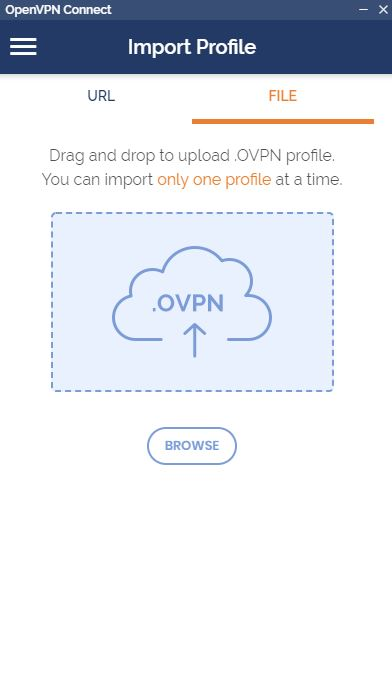

# Setting Up an Openvpn Server to Create a Virtual Robotics Lab Network 

Since the beginning of the pandemic, roboticists have been struggling to use their lab resources and do networking in a secure way. By using a VPN we can set up a network which mimics having all your devices on the same network in your lab. A VPN will encrypt all traffic allowing you to securely control simulation computers or robots remotely as long as you have an internet connection.



## VPN Server

The first thing we need to set up is a VPN server. This is a computer that will manage who can connect and will route all VPN traffic. In this tutorial I will use digital ocean to set up the vpn server. For $5 a month we can create a linux node that we can use as our VPN server. 

### Digital Ocean Discounts

If you are a currently a student you can redeem $50 worth of free credits by using the github student developer pack. This is enough to host a VPN server for 10 months! [Github Student Developer Pack](https://education.github.com/pack)

If you are not a student, you can use my affiliate link which will grant you $100 of credits for 60 days. This isn't as good as the student discount, but at least we can host a VPN for 2 months free. [Digital Ocean $100 for 60 days credit](https://m.do.co/c/6752af521fd4)

### Creating a Digital Ocean Node 

In the top left corner click `new project`. Fill out relevant information. Then click `Get Started with a Droplet`. 

A basic ubuntu 20.04 node will be perfect for this application.


- select the data center closest to your location 
- add your ssh key by following the instructions under `New SSH Key`

We should be ready to create our droplet!

### Installing Openvpn 

We will be using the easy install script.

follow the bellow tutorial 
https://nextsouls.com/how-to-install-openvpn-using-script-installer/

## Client Setup 

On the VPN Server we can re-run the install script to generate client connect files.

## Installing Openvpn Clients 

### Ubuntu Client Install

```
sudo apt install openvpn
```

### Connect from the Command Line
```
sudp openvpn --config ${client.ovpn}
```
connect via gui

### Connect via GUI

 You can also connect to your vpn via the ubuntu settings. Go to Network and click the plus next to VPN.



Then click `import from file`


add your `.ovpn` file and click `add`.

### Windows Mac

Download client: https://openvpn.net/download-open-vpn/

import openvpn profile

